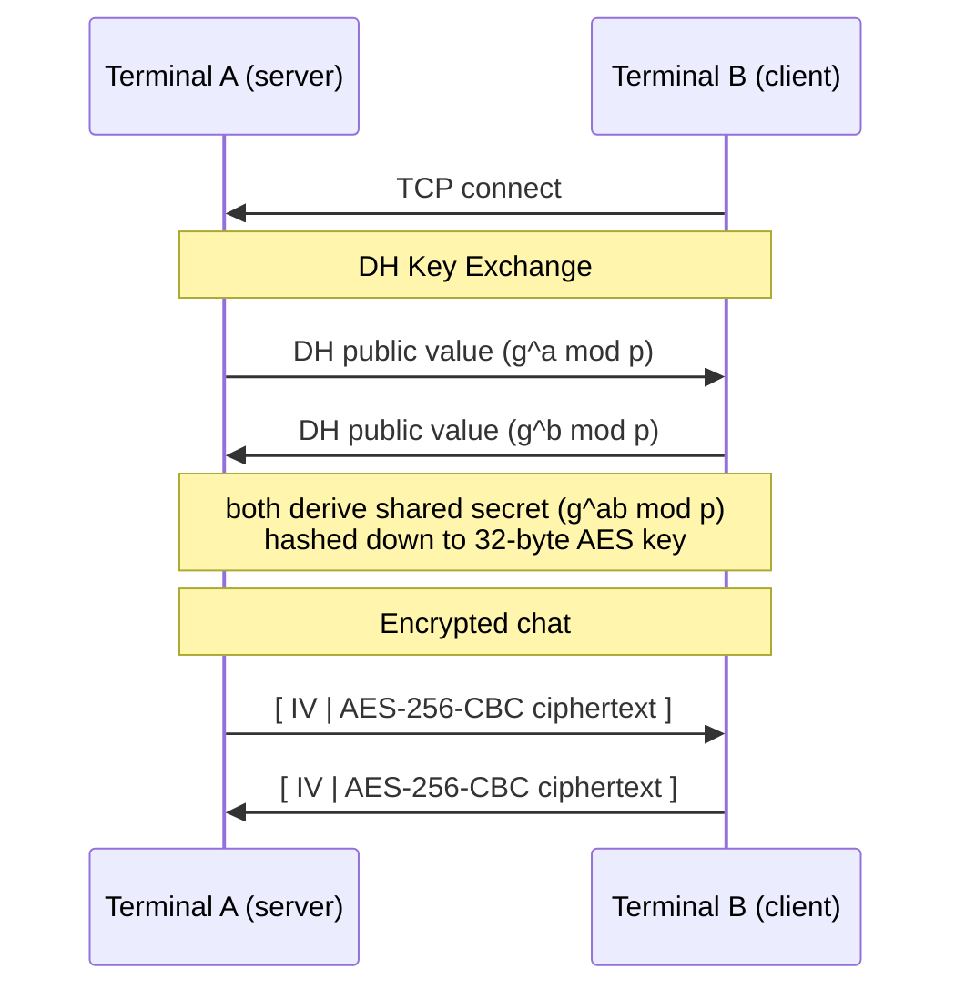

# secure_chat

Terminal-based encrypted chat over TCP. Two machines connect, do a Diffie-Hellman handshake to agree on a key, then talk over AES-256-CBC. No pre-shared secrets, no plaintext on the wire.

Tested on macOS and Linux.

---

## How it works



Each message gets a fresh random IV, so encrypting the same string twice produces different ciphertext. The shared key never travels over the wire — only the public DH values do.

---

## Dependencies

- `g++` (C++17)
- `make`
- OpenSSL 3
  - macOS: `brew install openssl@3`
  - linux: `sudo pacman -S openssl`

---

## Build

The Makefile has two `LFLAGS` blocks — one for macOS (Homebrew), one for Linux. Only one should be uncommented at a time.

**macOS** — open `Makefile` and swap the active `LFLAGS` line:
```makefile
# uncomment this:
LFLAGS := -L/opt/homebrew/opt/openssl@3/lib -lssl -lcrypto
# comment this out:
# LFLAGS := -lssl -lcrypto
```

Then build:
```bash
make
```

Binary lands at `output/main`.

---

## Usage

```bash
# machine 1 — start the server
./output/main server <port>

# machine 2 — connect
./output/main client <host> <port>
```

Example on localhost:
```bash
./output/main server 9000
./output/main client 127.0.0.1 9000
```

---

## TODO

- [ ] Test over a real network — two machines on the same WiFi, then over the internet
- [ ] Support multiple clients (currently 1-to-1 only)
- [ ] Message timestamps
- [ ] Usernames / display names
- [ ] Chat history saved to a local encrypted log
- [ ] Forward secrecy — re-key periodically so a leaked key doesn't expose the whole session
- [ ] Mutual authentication — right now there's no way to verify who you're talking to
- [ ] TUI with a proper split view (input at the bottom, chat history scrolling above)
- [ ] Docker setup for easy cross-machine testing
