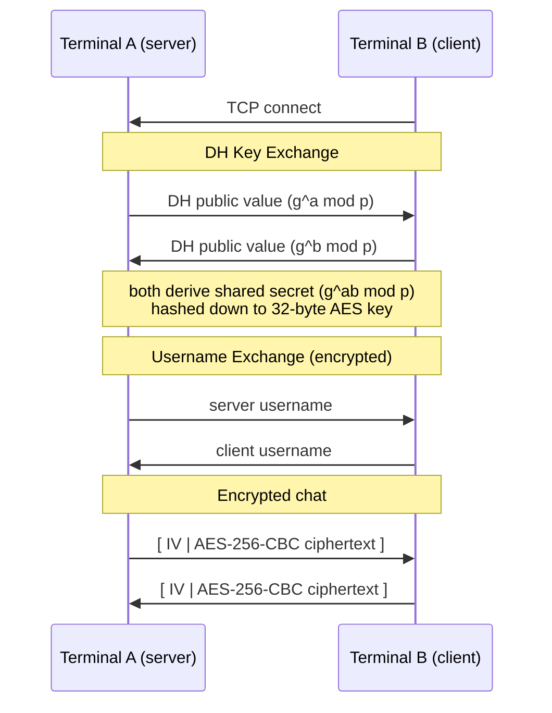

# secure_chat

Terminal-based encrypted chat over TCP. Two machines connect, do a Diffie-Hellman handshake to agree on a key, then talk over AES-256-CBC.

Tested on macOS and Linux.

---

## How it works



Each message gets a fresh random IV, so encrypting the same string twice produces different ciphertext.

---

## Dependencies

- `g++` (C++17)
- `cmake` (3.16+)
- OpenSSL 3
  - macOS: `brew install openssl@3`
  - linux: `sudo pacman -S openssl`

---

## Build

```bash
cmake -B build
cmake --build build
```

Binary lands at `build/output/main`.

CMake's `find_package(OpenSSL)` handles the library path automatically on both macOS and Linux.

---

## Usage

```bash
# machine 1 — start the server
./build/output/main server <port>

# machine 2 — connect
./build/output/main client <host> <port>
```

Example on localhost:
```bash
./build/output/main server 9000
./build/output/main client 127.0.0.1 9000
```

---

## TODO

- [ ] Support multiple clients (currently 1-to-1 only)
- [x] Message timestamps
- [x] Usernames / display names
- [X] Colourized chat output
- [ ] Chat history saved to a local encrypted log
- [ ] Forward secrecy, re-key periodically so a leaked key doesn't expose the whole session
- [ ] Mutual authentication
- [ ] TUI with a proper split view (input at the bottom, chat history scrolling above)
- [ ] Docker setup for easy cross-machine testing
